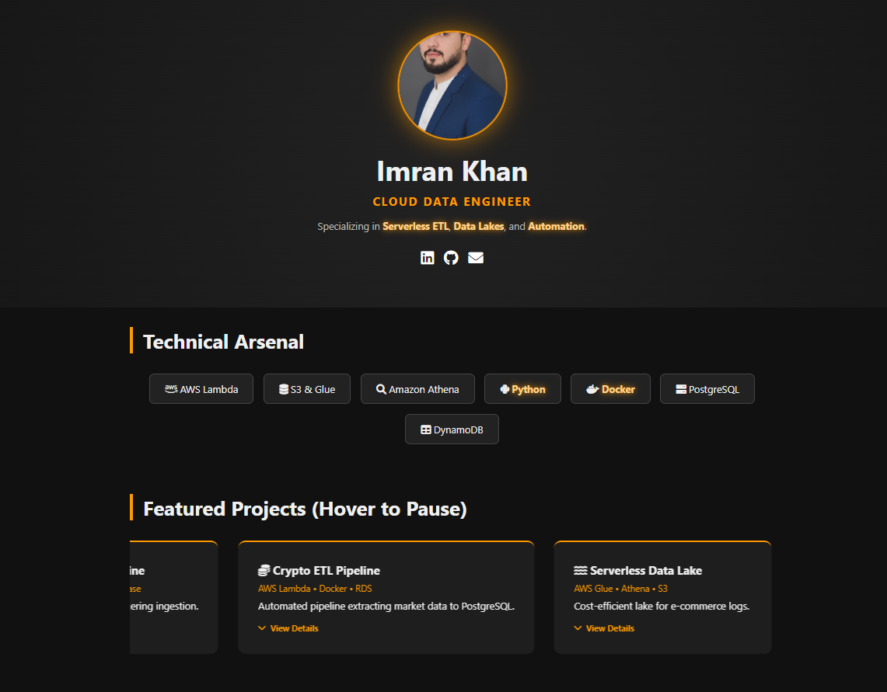
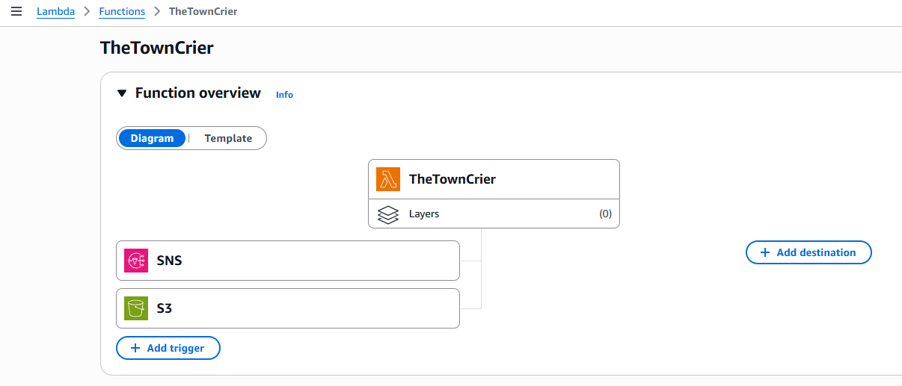
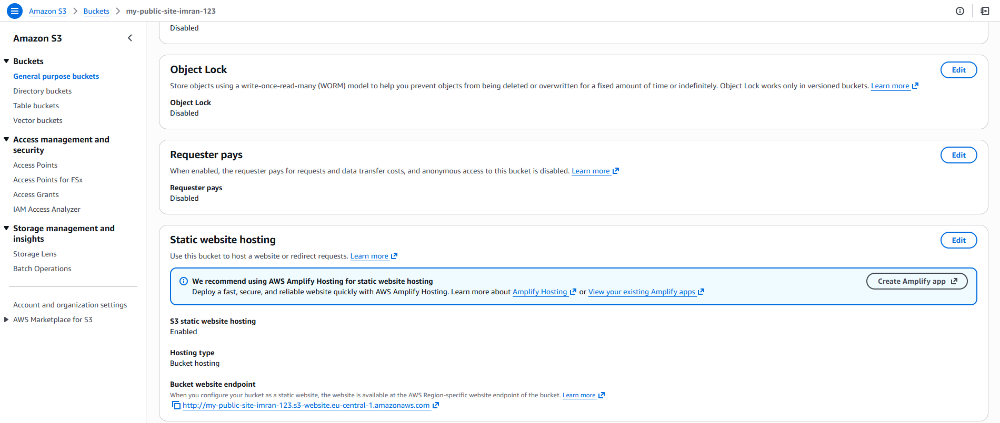
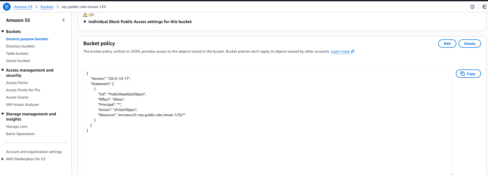
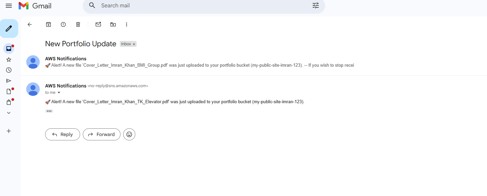

# AWS Serverless Portfolio & Event-Driven Notification System

## Executive Summary

This project showcases a cloud-native, serverless application architecture designed to host a professional portfolio website with high availability and near-zero maintenance. Hosted on Amazon S3, the frontend leverages static website hosting to deliver content globally without the overhead of managing web servers.

The backend is fully event-driven, utilizing AWS Lambda and Amazon SNS to create a reactive system that monitors the storage bucket for changes. When an administrator updates the portfolio content (e.g., uploading a new resume or project image), the system automatically triggers a decoupled notification pipeline, delivering real-time email alerts. This architecture demonstrates proficiency in Infrastructure as Code (IaC) principles via Python Boto3, security best practices through granular IAM roles, and cost optimization strategies by eliminating idle compute resources.

**Live Deployment:** [http://my-public-site-imran-123.s3-website.eu-central-1.amazonaws.com/]

## System Architecture

The solution implements a decoupled, event-driven architecture where storage events trigger asynchronous compute processes.

**Data Flow:**
1.  **Client Interaction:** Users access the static frontend hosted on an S3 bucket configured as a web server.
2.  **Event Generation:** Administrative uploads to the S3 bucket trigger a `s3:ObjectCreated:Put` event.
3.  **Serverless Compute:** The S3 event payload invokes an AWS Lambda function (Python 3.12).
4.  **Business Logic:** The Lambda function parses the event metadata using the Boto3 SDK to extract object keys and bucket details.
5.  **Notification Dispatch:** The function publishes a formatted message to an Amazon SNS Topic, which broadcasts an email alert to subscribed endpoints.

## Technical Highlights

* **Infrastructure as Code (IaC):** Python-based automation using Boto3 to programmatically interact with AWS services.
* **Security First:** Implemented Least Privilege access using IAM Roles (scoped strictly to SNS publishing) and S3 Bucket Policies for controlled public read access.
* **Event-Driven Design:** Utilized the "Fan-out" pattern (S3 to Lambda to SNS) to decouple storage from notification logic.
* **Cost Optimization:** Replaced traditional EC2 server infrastructure with S3 Static Hosting and Lambda, eliminating idle compute costs.

## Implementation Evidence

### Static Hosting Configuration
Amazon S3 bucket configured for static website hosting with a public endpoint.

### Security Configuration
Custom Bucket Policy allowing public `s3:GetObject` access while restricting write permissions.

### Verification
End-to-end validation confirming successful email delivery via Amazon SNS upon file upload.

## Deployment Instructions

1.  **Storage:** Provision an S3 bucket and enable Static Website Hosting.
2.  **Access Control:** Apply a Bucket Policy to permit public read access.
3.  **Messaging:** Create an Amazon SNS Topic and confirm an email subscription.
4.  **Compute:** Deploy the Python Lambda function with an execution role granting `AmazonSNSFullAccess`.
5.  **Automation:** Configure an S3 Event Notification to trigger the Lambda function on `PutObject` events.
